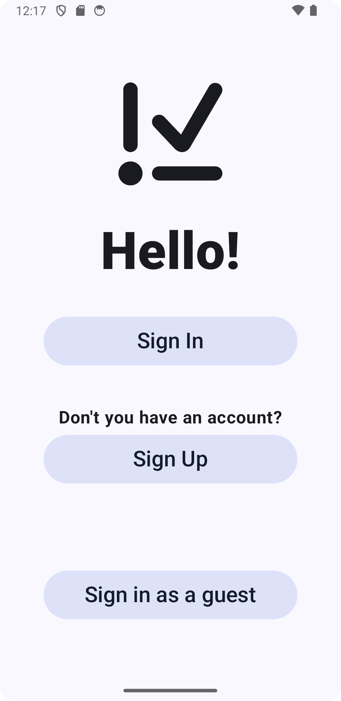
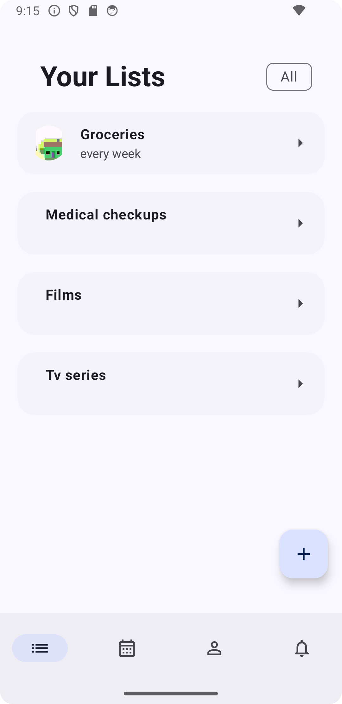
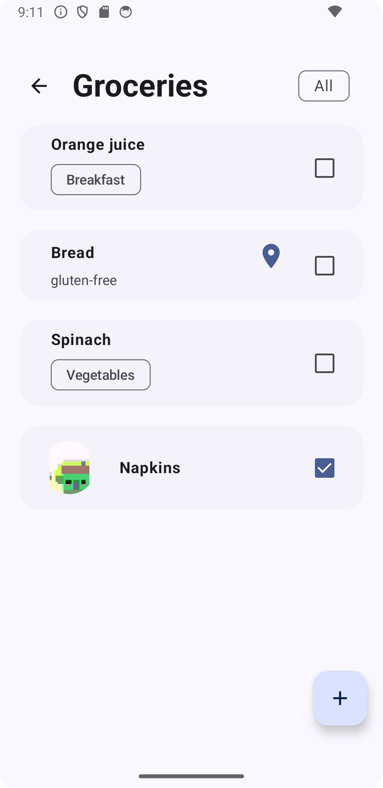
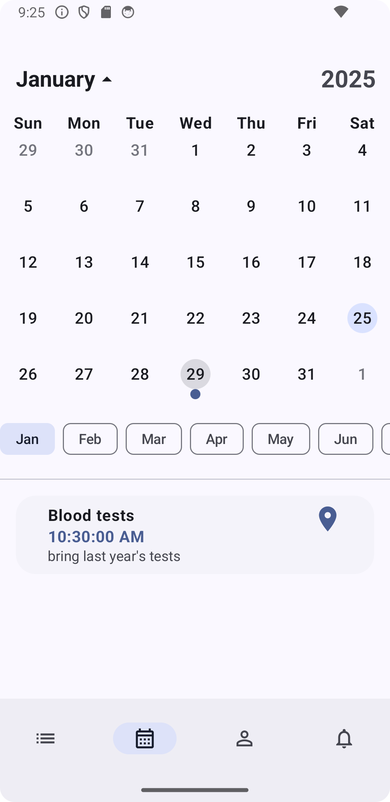

# RemindMe

  

# Screens

    
    
    
    

## Overview

Remainder is a prototype Jetpack Compose Android application designed to help users manage their
tasks and reminders efficiently.

## Features

- [x] **Task Management**: Create, edit, and delete _tasks_ with ease. Store them in _lists_, and
  use _categories_ and _tags_ to order them in the best way possible.
- [x] **Calendar**: Use it to see all your tasks with a deadline and have everything under control.
- [x] **Notifications**: Receive a notification for each task with a deadline so you never forget
  anything.
- [x] **Sync Data**: You can sync your data with
  [your server]{https://github.com/SadAlexa/RemindMe-server} to save it in the cloud and access it
  from any device.
- [ ] **Set the _frequency_ of a task and choose how long before it should notify you**

## Technologies Used

- **Android**: The application is built for the Android platform.
- **Jetpack Compose and Material Design 3**: For building the UI.
- **Room**: For local database management.
- **Koin**: For dependency management.
- **Coil**: For images upload.
- **Location Service and Open Street Map**: To be able to enter the location of the tasks.
- **DataStore**: For saving user preferences;
- **AlarmManager**: For notifications management.

## Usage

- Launch the application.
- If you want to synchronize your data with the server, enter your server link in the field and
  then "Sign Up". If you don't want to, you can click the “Sign in as a guest” button.
- Create a new list by clicking on the "Add List" button.
- If you want to divide your lists into categories, create them by clicking the “Add Category”
  button and then select one in the list creation.
- To create a task, go into a list (by clicking it) and then click the “Add Task” button.
- To better sort your tasks, I recommend creating tags (they only apply to the current list) by
  clicking the “Add Tag” button and adding it to the task as it is created
- To edit lists, tags categories, and tags, swipe from left to right.
- To delete lists, tags categories, and tags, swipe from right to left

## Future Improvements

This project is a prototype, and there are several features and improvements planned for future
releases, including:

- [x] User authentication and account management.
- [x] Cloud synchronization for tasks and reminders.
- [ ] Enhanced notification features.
- [ ] Improved UI/UX based on user feedback.

## License

This project is licensed under the MIT License - see the LICENSE file for details.
